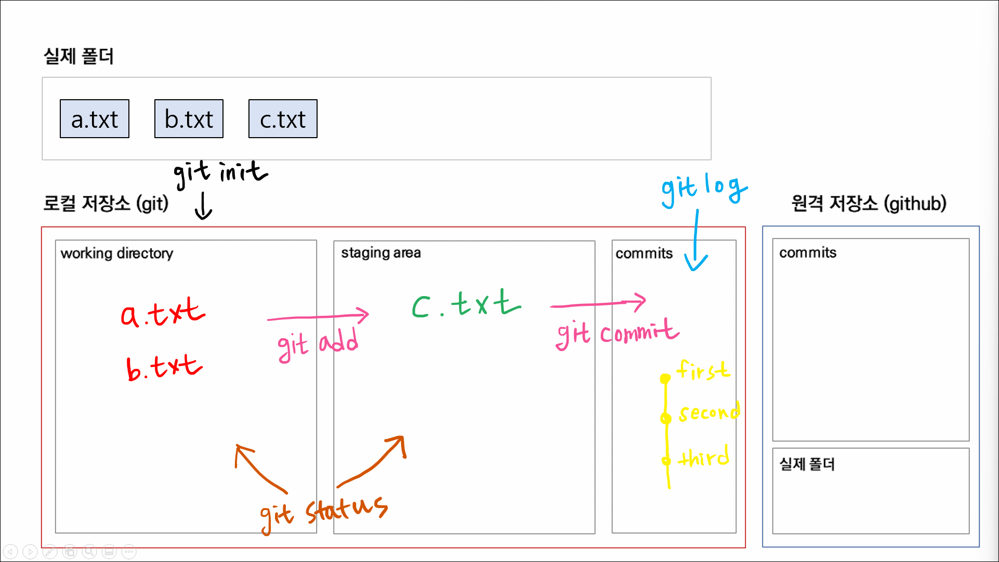

# Git/GitHub 공부 내용 정리
2023년 1월 11일 (수요일)

## Git 초기 설정
---
1. 누가 커밋 기록을 남걌는지 확인할 수 있도록 이름과 이메일을 설정합니다.
    - 작성자를 수정하고 싶을 때에는 이름, 메일 주소만 다르게 하여 동일하게 입력합니다.
```bash
$git config --global user.name "이름"
%git config --global user.email "메일 주소"
```
2. 작성자가 올바르게 설정되었는지 확인
```bash
$git config --global -l
or
$git config --global --list
```

## Git 기본 명령어
---
### 1. 로컬 저장소

- ``` Working Directory (= Working Tree)```: 사용자의 일반적인 작업이 일어나는 곳
- ```Staging Area (=Index)```: 커밋을 위한 파일 및 폴더가 추가되는 곳
- ```Repository```: Staging Area에 있던 파일 및 폴더의 변경사항(커밋)을 저장하는 곳
- Git은 **Working Directory -> Staging Area-> Repository** 의 과정으로 버전 관리를 수행 


### 2. git init
---
 ```bash
 $git init
```
- 현재 작업 중인 디렉토리를 Git으로 관리한다는 명령어
- ```.git``` 이라는 숨김 폴더를 생성하고, 터미널에는 ```(master)```라고 표기됩니다.
- Mac OS의 경우 ```(master)```가 표기되지 않는데, Terminal 업그레이드를 통해 표기할 수 있습니다.
> 주의 사항
> 1. 이미 git 저장소인 폴더 내에 또 다른 Git 저장소를 만들지 않기 
> 즉, 터미널에 이미 (Master)가 있다면, git init을 절대 하지 않기 
> 2. 절대로 홈 디렉토리에서 git init을 하지 않습니다. 터미널의 경로가 ~인지 확인


### 3. git status
---
```bash
$git status
```
- Working Directory와 Staging Area에 있는 파일의 현재 상태를 알려주는 명령어
- 어떤 작업을 시행하기 전에 수시로 status를 확인하면 좋습니다.
- 상태
  1. ```Untracked```: Git이 관리하지 않는 파일
  2. ```Tracked```: Git이 관리하는 파일
     1. ```Unmodified```: 최신상태
     2. ```Modified```: 수정되었지만 아직 Staging Area에는 반영하지 않는 상태
     3. ```Staged```: Staging Area에 올라간 상태
   


### 4. git add
---
```bash
#특정 파일
$git add a.txt
#특정 폴더
$git add my_folder/
#현재 디렉토리에 속한 파일/폴더 전부
$git add.
```
- Working Directory에 있는 파일을 Staging Area로 올리는 명령어
- Git이 해당 파일을 추적(관리)할 수 있도록 만듬
- ```Untracked, Modified -> Staged``` 로 상태 변경됨


### 5. git commit
---
```bash
$git commit -m "first commit"
```
- Staging Area에 올라온 파일의 변경 사항을 하나의 버전으로 저장하는 명령어
- 커밋 메시지는 현재 변경 사항들을 잘 나타낼 수 있도록 의미 있게 작성하는 것을 권장
- 각각의 커밋은 SHA-1알고리즘에 의해 반환된 고유의 해시 값을 ID로 가짐
- root-commit 은 해당 커밋이 최초의 커밋 일 때만 표시됩니다. 이후 커밋부터는 사라집니다.


### 6. git log
---
```bash
$git log
```
- 커밋 내역(ID, 작성자, 시간, 메세지 등)을 조회할 수 있는 명령어
- 옵션
  - ```--oneline```: 한 줄로 축약해서 보여줍니다.
  - ```--graph```: 브랜치와 머지 내역을 그래프로 보여줍니다.
  - ```--all```: 현재 브랜치를 포함한 모든 브랜치의 내역을 보여줍니다.
  - ```--reverse```: 커밋 내역의 순서를 반대로 보여줍니다.(최신이 가장 아래)
  - ```-p```: 파일의 변경 내용도 같이 보여줍니다.
  - ```-2```: 원하는 갯수 만큼의 내역을 보여줍니다.(2말고 임의의 숫자 사용 가능)


### 7. git 명령어 한눈에 보기
